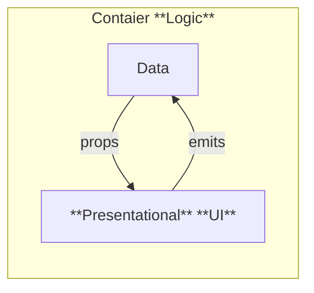

---
# You can also start simply with 'default'
theme: default
# random image from a curated Unsplash collection by Anthony
# like them? see https://unsplash.com/collections/94734566/slidev
# background:

# some information about your slides (markdown enabled)
title: vueを責務分離して書くための`Container/Presentational`パターンの紹介
# apply unocss classes to the current slide
class: text-left
# https://sli.dev/features/drawing
drawings:
  persist: false
# slide transition: https://sli.dev/guide/animations.html#slide-transitions
transition: slide-left
# enable MDC Syntax: https://sli.dev/features/mdc
mdc: true
# open graph
# seoMeta:
#  ogImage: https://cover.sli.dev
fonts:
  # basically the text
  sans: 'Robot'
  # use with `font-serif` css class from windicss
  serif: 'Robot Slab'
  # for code blocks, inline code, etc.
  mono: 'Fira Code'
---


# vueを責務分離して書くためのContainer/Presentationalパターンの紹介<logos-vue />

<div class="abs-br m-6 text-xl">
  <button @click="$slidev.nav.openInEditor()" title="Open in Editor" class="slidev-icon-btn">
    <carbon:edit />
  </button>
  <a href="https://github.com/WATA-Haru" target="_blank" class="slidev-icon-btn">
    <carbon:logo-github />
  </a>
</div>

<div class="absolute bottom-0 right-0 p-2 text-xs text-dark">
  {{ $slidev.nav.currentPage }} / {{ $slidev.nav.total }}
</div>

<!--
The last comment block of each slide will be treated as slide notes. It will be visible and editable in Presenter Mode along with the slide. [Read more in the docs](https://sli.dev/guide/syntax.html#notes)
-->
-----
---
layout: center
---

# 📝 目次

<br>

## 1. **伝えたいこと**

<br>

## 2. 話すこと・話さないこと

<br>

## 3. Vue用語と認識の整理

<br>

## 4. Container/Presentationalパターン

<br>

## 5. Container/Presentationalの利点

<div class="absolute bottom-0 right-0 p-2 text-xs text-dark">
{{ $slidev.nav.currentPage }} / {{ $slidev.nav.total }}
</div>

-----
---
layout: statement
---

# <span class="font-size-120%">伝えたいこと</span>

<br>
<br>
<br>

# **Vueは「1ファイルに全部書く」<br>だけじゃない！**
<br>

# **責務分離して書ける <logos-vue />**

<br>

<div class="absolute bottom-0 right-0 p-2 text-xs text-dark">
{{ $slidev.nav.currentPage }} / {{ $slidev.nav.total }}
</div>

-----

# 2. 話すこと・話さないこと
<br>

## 話すこと🙆‍♂️
<br>

  - 案件の簡単な紹介と使用技術
  - Vue用語の整理（Reactでいうと」の補足あり）
  - **Container/PresentationalパターンでのVue責務分離方法**

## 話さないこと🙅‍♀️
<br>

  - 案件の詳細（プロダクト、開発体制など）
  - Container/Presentationalパターンの是非 (他パターンとの比較はしません)

<div class="absolute bottom-0 right-0 p-2 text-xs text-dark">
{{ $slidev.nav.currentPage }} / {{ $slidev.nav.total }}
</div>

-----

# 3. 案件の簡単紹介 & 使用技術

  - NTTコミュニケーションズの案件です (7月よりdocomo businessに社名変更)
  - 超簡単にいうと、**GUIでインフラを構築する**サービスを作っています
<br>
<br>

<div class="flex justify-center">

</div>

<br>

- 技術スタック: **Nuxt, Vue, TypeScript**, JavaScript, vistest, jest, historie, playwright etc...
<div class="flex gap-10px">
<logos-pinia />
<logos-vue />
<logos-vitest />
<logos-nuxt-icon />
<logos-typescript-icon />
<logos-javascript />
<logos-playwright />
</div>
<br>


-----

# 3. 用語の整理
<br>

## Vue.jsとは？<logos-vue />

<br>

<div class="font-size-130%">

  - [Evan You](https://github.com/yyx990803)氏によるJavaScriptフレームワーク。
  - HTML, CSS, JSを1ファイルにまとめ、**コンポーネント指向**で直感的に記述
  - **リアクティビティ**: JavaScriptの状態変化を自動追跡し、効率的にDOMを更新

</div>
  
  

<div class="absolute bottom-0 right-0 p-2 text-xs text-dark">
{{ $slidev.nav.currentPage }} / {{ $slidev.nav.total }}
</div>

-----

# 3. 用語の整理

## SFC (Single File Component) とは
<br>

コンポーネントのロジック（JavaScript）、テンプレート（HTML）、スタイル（CSS）を**単一ファイル**に収めたもの（`*.vue`）

```vue
<script setup>
import { ref } from 'vue'
const count = ref(0) // リアクティブな変数
</script>


<template>
  <button @click="count++">Count is: {{ count }}</button>
</template>

<style scoped>
button {
  font-weight: bold;
}
</style>
```

<div class="absolute bottom-0 right-0 p-2 text-xs text-dark">
{{ $slidev.nav.currentPage }} / {{ $slidev.nav.total }}
</div>

-----

# 3. 責務分離（関心の分離）

<div class="font-size-120%">

  - 各コンポーネントが持つ責任を分離すること。
  - 今回は**UI（見た目）** と **ロジック（処理）** の分離に絞って話します。

</div>
  

<br>

<div class="flex justify-center">



</div>


<div class="absolute bottom-0 right-0 p-2 text-xs text-dark">
{{ $slidev.nav.currentPage }} / {{ $slidev.nav.total }}
</div>


-----
---
layout: two-cols-header
---

# 4. Container/Presentationalパターン

### 処理(logic)と見た目(UI)分ける設計パターン

::left::
### **Container🤖**

- **ロジック**を責務とする
- データフェッチ、イベント処理、状態管理
<br>(LocalStorageなど) に集中
- **例**:データを取得してPresentationalに渡す

<br>
<br>
<br>
<br>
<br>
<br>
<br>


::right::

### **Presentational**👁‍🗨

- **UI（見た目）** を責務とする
- **親から受け取った値の描画**に集中
- UIイベント（クリックなど）を親に通知
- **例:** 受け取ったデータを表示するボタン

<div class="absolute bottom-0 right-0 p-2 text-xs text-dark">
{{ $slidev.nav.currentPage }} / {{ $slidev.nav.total }}
</div>

-----

# 4.  親子でのコンポーネント間のやり取り

<br>

### UIとロジックを分離すると、異なるコンポーネント間でデータやイベントをやり取りする方法が必要になります🚀

<br>

### 1. **Props**: 親から子へデータを渡す

  - Presentationalは親から渡されたデータを描画。

<br>


### 2. **Emit**: 子から親へイベントを通知

  - PresentationalのUIイベント（ボタンクリックなど）を親に伝える。

<div class="absolute right-15px bottom-35px">


</div>


<div class="absolute bottom-0 right-0 p-2 text-xs text-dark">
{{ $slidev.nav.currentPage }} / {{ $slidev.nav.total }}
</div>

-----

# 4. Container/Presentationalパターン (Propsの例)

#### `ChildComp.vue` (Presentational側)

```vue
<script setup>
const props = defineProps({ msg: String })
</script>

<template>
  <h2>{{ msg || 'No props passed yet' }}</h2>
</template>
```

#### `App.vue` (Container側)

```vue
<script setup>
import { ref } from 'vue'
import ChildComp from './ChildComp.vue'

const greeting = ref('Hello from parent')
</script>

<template>
  <ChildComp :msg="greeting"/>
</template>
```

`"Hello from parent"` が `ChildComp` に渡されます。

<div class="absolute bottom-0 right-0 p-2 text-xs text-dark">
{{ $slidev.nav.currentPage }} / {{ $slidev.nav.total }}
</div>

-----
---
layout: statement
---

</img>

-----
---
layout: two-cols-header
---

# 4. Container/Presentationalパターン(Emitの例)

::right::

`ChildComp.vue` (Presentational側)

```vue
<script setup lang="ts">
const emit = defineEmits<{
  (event: "click:button", message: string): void
}>()

const handleClick = () => {
  emit('click:button', "Hello from Child"); // イベントを発火
}
</script>

<template>
  <button @click="handleClick">click me</button>
</template>
```

::left::

`App.vue` (Container側)


```vue
<script setup lang="ts">
import { ref } from 'vue'
import ChildComp from './ChildComp.vue'

const childMsg = ref('No child msg yet')
</script>

<template>
  <ChildComp
    @click:button="(message) => childMsg = message"
  />
  <p>{{ childMsg }}</p>
</template>
```

ボタンを押すと「Hello from Child」が表示されます。

<div class="absolute bottom-0 right-0 p-2 text-xs text-dark">
{{ $slidev.nav.currentPage }} / {{ $slidev.nav.total }}
</div>

-----
---
layout: statement
---

</img>

-----
---
layout: two-cols
---


# 4. 補足: Composables (ReactでいうHooks)

  - Vueのリアクティブな**状態を持つロジックをカプセル化し、再利用**するための関数。
  - データフェッチやマウス位置取得など、時間やユーザー操作で変化する要素を管理。
  - Containerコンポーネント内で利用し、ロジックをさらに分離・整理できる。

::right::

```js {4-14|all}
// mouse.js
import { ref, onMounted, onUnmounted } from 'vue'

// 慣習として、コンポーザブル関数の名前は "use" で始めます
export function useMouse() {
  // コンポーザブルによってカプセル化および管理される状態
  const x = ref(0)
  const y = ref(0)

  // コンポーザブルは管理している状態を時間の経過とともに更新できます。
  function update(event) {
    x.value = event.pageX
    y.value = event.pageY
  }

  // コンポーザブルは所有コンポーネントのライフライクルにフックして
  // 副作用のセットアップや破棄することもできます。
  onMounted(() => 
    window.addEventListener('mousemove', update)
  )
  onUnmounted(() => 
    window.removeEventListener('mousemove', update)
  )

  // 管理された状態を戻り値として公開
  return { x, y }
}
```

<div class="absolute bottom-0 right-0 p-2 text-xs text-dark">
{{ $slidev.nav.currentPage }} / {{ $slidev.nav.total }}
</div>


-----

# 5. Container/Presentationalの利点

  - **責務の明確化**: UIとロジックが分離され、コードの見通しが良くなる。
  - **再利用性**: Presentationalコンポーネントは見た目だけなので、様々なロジックを持つContainerコンポーネントから利用可能。
  - **テストのしやすさ**:
      - Presentational: PropsとEmitの入出力のみでUIのテストが容易。
      - Container: UIに依存せずロジックの単体テストが可能。
  - **開発効率**: チーム開発において、UI担当とロジック担当で分担しやすい。

<div class="absolute bottom-0 right-0 p-2 text-xs text-dark">
{{ $slidev.nav.currentPage }} / {{ $slidev.nav.total }}
</div>

-----
# ここまでのまとめ

<div class="font-size-120%">

### 😱一つに全部書いたときの問題点
  - Vueは**SFC**(Single File Component) で書ける。
  - JavaScriptの状態変化を自動追跡する**リアクティブ**な仕組みを持つ。
  - SFCにすべて書くと責務が混在する😭
  
  <br>
  <br>

### 🌟解決策 
  - **Container/Presentationalパターン**で**UI**と**ロジック**の責務を分離できる。
      - **Props**: 親から子へ値を渡す。
      - **Emit**: 子から親へ「イベント名」と「値」を通知する。
  - **Composables**で状態にかかわるロジックをさらに整理・再利用可能。

</div>

<div class="absolute bottom-0 right-0 p-2 text-xs text-dark">
{{ $slidev.nav.currentPage }} / {{ $slidev.nav.total }}
</div>

